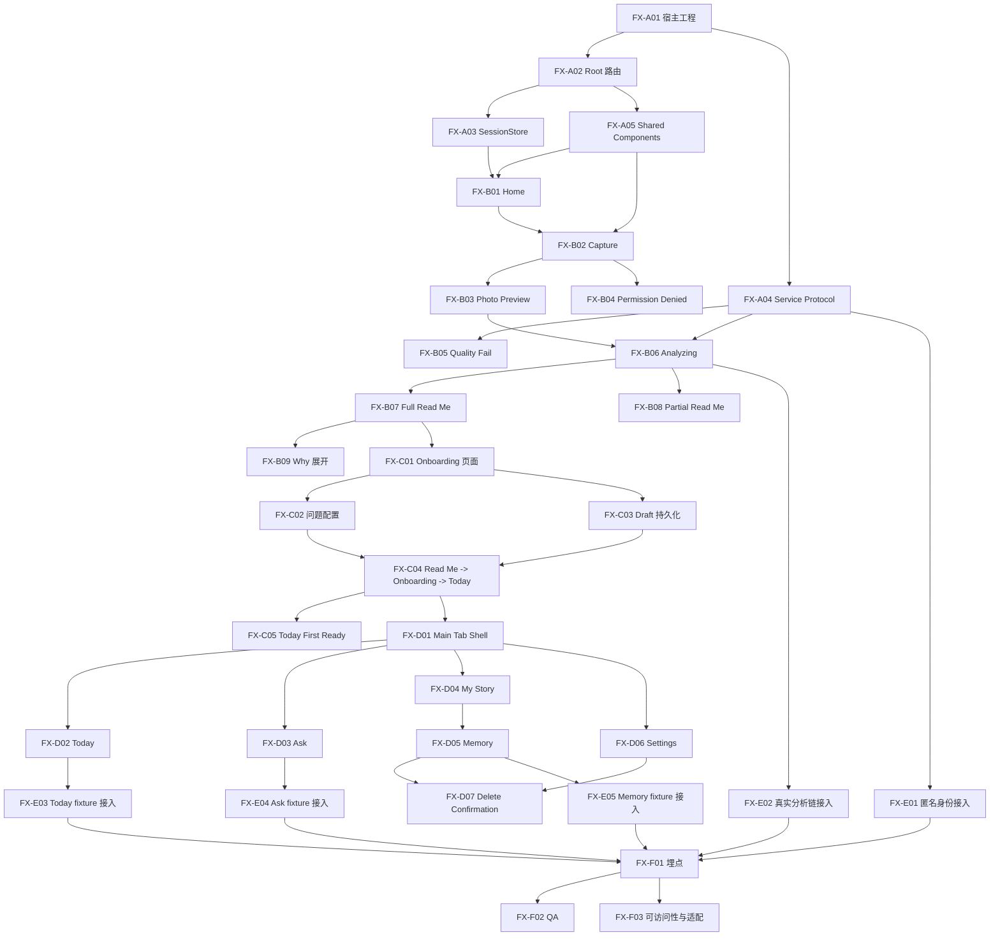

# FaceXiang v1 开发顺序图

## 1. 说明

本文件回答：

- 先做哪些页
- 哪些任务可以并行
- 哪些任务必须等上一步完成

判断原则：

- 以 `first aha` 为最高优先级
- 先打通首次链路，再补 tab 壳和壳层页面
- 先 mock 跑通页面，再接真实数据

## 2. 阶段总览

### Phase 0：宿主与状态机

必须先完成：

- iOS App 宿主
- Root 路由
- SessionStore
- Shared components

### Phase 1：First Session 页面链路

必须先完成：

- Home
- Capture
- Photo Preview
- Permission Denied
- Quality Fail
- Analyzing
- Full / Partial Read Me

### Phase 2：承接与首次连续关系

必须先完成：

- Context Onboarding
- Today First Ready
- `Read Me -> Onboarding -> Today First Ready`

### Phase 3：主 Tab 壳

可在 Phase 2 后快速并行：

- Main Tab Shell
- Today
- Ask
- My Story
- Memory
- Settings

### Phase 4：接口与 QA

最后接：

- 匿名身份
- 真实分析链
- mock Today / Ask / Memory
- 埋点
- QA

## 3. 开发顺序图

## 4. 可并行开发块

## 4.1 宿主完成后可并行

可以同时做：

- `Home`
- `Capture / Photo Preview / Permission Denied`
- `Shared Components`
- `Service Protocol`

不建议并行：

- `Read Me`
- `Onboarding`

因为它们依赖前面页面和状态机已经稳定。

## 4.2 First Session 中可并行

可以并行：

- `Quality Fail`
- `Analyzing`
- `Why 卡片`

前提：

- `Capture` 和状态机接口已冻结

## 4.3 Main Tab 中可并行

进入 `MainTabShell` 后，可以分 3 条线并行：

### 线 A

- `Today`

### 线 B

- `Ask`

### 线 C

- `My Story`
- `Memory`
- `Settings`
- `Delete Confirmation`

约束：

- 4 个 tab 的命名、tab bar 样式、导航头样式必须先统一

## 4.4 数据接入中可并行

可以并行：

- 匿名身份接入
- 真实分析链接入
- Today fixture
- Ask fixture
- Memory fixture

前提：

- 页面 ViewState 已冻结

## 5. 推荐执行顺序

## Sprint 1

- `FX-A01`
- `FX-A02`
- `FX-A03`
- `FX-A04`
- `FX-A05`

目标：

- 先把 App 壳和状态机打好

## Sprint 2

- `FX-B01`
- `FX-B02`
- `FX-B03`
- `FX-B04`
- `FX-B05`
- `FX-B06`

目标：

- 图片输入到 analyzing 全链路跑通

## Sprint 3

- `FX-B07`
- `FX-B08`
- `FX-B09`
- `FX-C01`
- `FX-C02`
- `FX-C03`
- `FX-C04`
- `FX-C05`

目标：

- first aha 完整闭环跑通

## Sprint 4

- `FX-D01`
- `FX-D02`
- `FX-D03`
- `FX-D04`
- `FX-D05`
- `FX-D06`
- `FX-D07`

目标：

- 主 tab 壳和所有壳层页面可预览

## Sprint 5

- `FX-E01`
- `FX-E02`
- `FX-E03`
- `FX-E04`
- `FX-E05`
- `FX-F01`
- `FX-F02`
- `FX-F03`

目标：

- 真实/模拟数据驱动页面
- 埋点与 QA 闭环

## 6. 不建议的顺序

不要先做：

- `Today Ready` 视觉细节
- `Ask` 的深层交互细节
- `My Story` 历史时间线细节

如果 `Read Me -> Onboarding -> Today First Ready` 这条链还没稳定，先做这些会浪费时间。

## 7. 一句话结论

工程顺序必须是：

`宿主和状态机 -> First Session -> Onboarding 承接 -> Main Tab 壳 -> 数据接入 -> QA`

而不是：

`先补壳层页面，再回头补核心 first aha`
